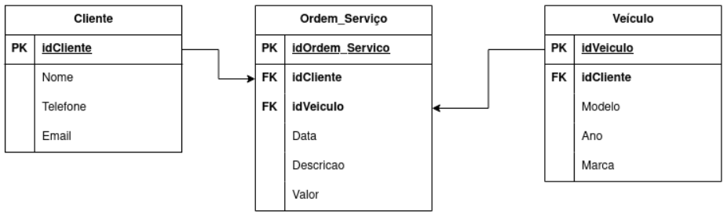

# 🔧 Projeto Django - Oficina Mecânica


Este projeto é uma aplicação web desenvolvida com Django e Django REST Framework que simula a modelagem de uma **oficina mecânica**, com controle de clientes, veículos e serviços prestados.

---

## 🧱 Modelagem de Dados

A modelagem da aplicação segue o seguinte diagrama entidade-relacionamento:



---

## 🚀 Tecnologias utilizadas

- Python
- Django
- Django REST Framework
- PostgreSQL
- django-filter

---

## 📁 Estrutura do Projeto

O projeto é composto pelas seguintes entidades:

- **Client**: cadastro de clientes
- **Vehicle**: cadastro de veículos
- **Service**: serviços prestados a um cliente para determinado veículo

---

## 🧰 Passo a passo para execução

### 0️⃣ Configurar ambiente virtual (recomendado)

Para isolar as dependências do projeto, utilize um ambiente virtual:

```bash
python -m venv venv
# No Linux/macOS
source venv/bin/activate
# No Windows
venv\Scripts\activate
```
---

### 1️⃣ Criar projeto Django no PyCharm

- Novo projeto com **admin habilitado**
- Nome do app: `oficina`

---

### 2️⃣ Instalar dependências

```bash
python -m pip install --upgrade pip
pip install psycopg2-binary djangorestframework django-filter
pip freeze > requirements.txt
```

---

### 3️⃣ Configurar apps no `django/settings.py`

```python
INSTALLED_APPS = [
    ...
    'rest_framework',
    'django_filters',
]
...
DATABASES = {
    'default': {
        'ENGINE': 'django.db.backends.postgresql_psycopg2',
        'NAME': 'oficina',
        'HOST': '127.0.0.1',
        'PORT': '5432',
        'USER': 'postgres',
        'PASSWORD': 'postgres'
    }
}
```

---

### 4️⃣ Criar os modelos (`oficina/models.py`)

```python
from django.db import models

class ModelBase(models.Model):
    id = models.BigAutoField(
        db_column='id',
        null=False,
        primary_key=True
    )
    created_at = models.DateTimeField(
        db_column='dt_created',
        auto_now_add=True,
        null=True
    )
    modified_at = models.DateTimeField(
        db_column='dt_modified',
        auto_now=True,
        null=True
    )
    active = models.BooleanField(
        db_column='cs_active',
        null=False,
        default=True
    )
    class Meta:
        abstract = True
        managed = True

class Client(ModelBase):
    name = models.CharField(
        db_column='tx_nome',
        max_length=70,
        null=False
    )
    phone = models.CharField(
        db_column='tx_fone',
        max_length=10,
        null=False
    )
    email = models.CharField(
        db_column='tx_email',
        max_length=70,
        null=False
    )
    def __str__(self):
        return f"{self.id} - {self.name}"

class Vehicle(ModelBase):
    model = models.CharField(
        db_column='tx_modelo',
        max_length=20,
        null=False
    )
    brand = models.CharField(
        db_column='tx_marca',
        max_length=20,
        null=False
    )
    year = models.IntegerField(
        db_column='nb_ano',
        null=False
    )
    def __str__(self):
        return f"{self.id} - {self.model}"

class Service(ModelBase):
    client = models.ForeignKey(
        Client,
        db_column='id_client',
        null=False,
        on_delete=models.DO_NOTHING
    )
    vehicle = models.ForeignKey(
        Vehicle,
        db_column='id_vehicle',
        null=False,
        on_delete=models.DO_NOTHING
    )
    repair = models.CharField(
        db_column='tx_reparo',
        max_length=255,
        null=False
    )
    cost = models.IntegerField(
        db_column='nb_custo',
        null=False
    )
    def __str__(self):
        return (f"Custo:{self.cost} - Reparo:{self.repair}",
                f"Cliente:{self.client}, "
                f"Vehicle:{self.vehicle.model}, "
                f"Vehicle:{self.vehicle.brand}, ")
```

---

### 5️⃣ Criar e aplicar migrations

```bash
python manage.py showmigrations
python manage.py makemigrations
python manage.py migrate
```

---

### 6️⃣ Criar serializadores (`oficina/serializers.py`)

```python
from rest_framework import serializers
from oficina.models import Client, Vehicle, Service

class ClientSerializer(serializers.ModelSerializer):
    name = serializers.CharField(
        min_length=3,
        max_length=20,
        error_messages={
            'max_length': 'O nome deve ter no máximo 20 caracteres.',
            'min_length': 'O nome deve ter no mínimo 3 caracteres.'
        }
    )
    class Meta:
        model = Client
        fields = ['id', 'name', 'phone', 'email']

class VehicleSerializer(serializers.ModelSerializer):
    year = serializers.IntegerField(
        min_value=2015,
        error_messages={
            'min_value': 'Veículo muito velho! (mín: 2015~).'
        }
    )
    class Meta:
        model = Vehicle
        fields = ['id', 'model', 'brand', 'year']

class ServiceSerializer(serializers.ModelSerializer):
    client = ClientSerializer(read_only=True)
    client_id = serializers.PrimaryKeyRelatedField(queryset=Client.objects.all(), source='client', write_only=True)
    vehicle = VehicleSerializer(read_only=True)
    vehicle_id = serializers.PrimaryKeyRelatedField(queryset=Vehicle.objects.all(), source='vehicle', write_only=True)

    class Meta:
        model = Service
        fields = ['id', 'client_id', 'client', 'vehicle_id', 'vehicle', 'repair', 'cost']
```

---

### 7️⃣ Criar as views (`oficina/views.py`)

```python
from rest_framework import viewsets, permissions
from oficina.models import Client, Vehicle, Service
from oficina.serializers import ClientSerializer, VehicleSerializer, ServiceSerializer
from oficina.filters import ClientFilter, VehicleFilter, ServiceFilter
from django_filters.rest_framework import DjangoFilterBackend

class ClientViewSet(viewsets.ModelViewSet):
    queryset = Client.objects.all()
    serializer_class = ClientSerializer
    permission_classes = [permissions.IsAuthenticated]
    filter_backends = [DjangoFilterBackend]
    filterset_class = ClientFilter

class VehicleViewSet(viewsets.ModelViewSet):
    queryset = Vehicle.objects.all()
    serializer_class = VehicleSerializer
    permission_classes = [permissions.IsAuthenticated]
    filter_backends = [DjangoFilterBackend]
    filterset_class = VehicleFilter

class ServiceViewSet(viewsets.ModelViewSet):
    queryset = Service.objects.all()
    serializer_class = ServiceSerializer
    permission_classes = [permissions.IsAuthenticated]
    filter_backends = [DjangoFilterBackend]
    filterset_class = ServiceFilter
```

---

### 8️⃣ Criar as rotas do app (`oficina/urls.py`)

```python
from django.urls import path, include
from rest_framework.routers import DefaultRouter
from oficina.views import ClientViewSet, VehicleViewSet, ServiceViewSet

router = DefaultRouter()
router.register(r'clients', ClientViewSet)
router.register(r'vehicle', VehicleViewSet)
router.register(r'services', ServiceViewSet)

urlpatterns = [
    path('', include(router.urls)),
]
```

---

### 9️⃣ Incluir rotas no projeto (`django/urls.py`)

```python
from django.contrib import admin
from django.urls import path, include

urlpatterns = [
    path('', include('oficina.urls')),
    path('admin/', admin.site.urls),
    path('api-auth/', include('rest_framework.urls')),
]
```

---

### 🔟 Configurar o `REST_FRAMEWORK` em `django/settings.py`

```python
REST_FRAMEWORK = {
    'DEFAULT_PAGINATION_CLASS': 'rest_framework.pagination.LimitOffsetPagination',
    'DEFAULT_FILTER_BACKENDS': ['django_filters.rest_framework.DjangoFilterBackend']
}
```

---

### 1️⃣1️⃣ Criar os filtros (`oficina/filters.py`)

```python
import django_filters
from oficina.models import Client, Vehicle, Service

class ClientFilter(django_filters.FilterSet):
    name = django_filters.CharFilter(lookup_expr='icontains')
    phone = django_filters.CharFilter(lookup_expr='exact')
    email = django_filters.CharFilter(lookup_expr='exact')

    class Meta:
        model = Client
        fields = ['id', 'name', 'phone', 'email']

class VehicleFilter(django_filters.FilterSet):
    model = django_filters.CharFilter(lookup_expr='icontains')
    brand = django_filters.CharFilter(lookup_expr='icontains')
    year = django_filters.NumberFilter(field_name='year', lookup_expr='exact')

    class Meta:
        model = Vehicle
        fields = ['model', 'brand', 'year']

class ServiceFilter(django_filters.FilterSet):
    client_id = django_filters.NumberFilter(field_name='client__id')
    client_name = django_filters.CharFilter(field_name='client__name', lookup_expr='icontains')
    vehicle_id = django_filters.NumberFilter(field_name='vehicle__id')
    vehicle_model = django_filters.CharFilter(field_name='vehicle__model', lookup_expr='icontains')
    vehicle_brand = django_filters.CharFilter(field_name='vehicle__brand', lookup_expr='icontains')

    class Meta:
        model = Service
        fields = ['id', 'client_id', 'client_name', 'vehicle_id', 'vehicle_model', 'vehicle_brand']
```

---

### 1️⃣2️⃣ Criar superusuário

```bash
python manage.py createsuperuser
```

---

### 1️⃣3️⃣ Executar o servidor

```bash
python manage.py runserver
```

---

### 1️⃣4️⃣ Rodar a aplicação

- Acesse: http://localhost:8000/
- Testar os endpoints via Postman/Insomnia (GET/POST)
  
---

### 1️⃣5️⃣ Testar e subir para o GitHub

- Versionar com Git e subir para o GitHub

```bash
git init
git add .
git commit -m "Projeto oficina mecânica - versão inicial"
git remote add origin https://github.com/seuusuario/oficina-mecanica.git
git push -u origin master
```

---

## ✅ Endpoints disponíveis

| Recurso    | Endpoint REST        |
|------------|----------------------|
| Clientes   | `/clients/`          |
| Veículos   | `/vehicles/`         |
| Serviços   | `/services/`         |

---

## 🤝 Contribuindo

1. Fork o repositório.
2. Crie uma branch para sua feature (`git checkout -b feature/nova-feature`).
3. Faça commit das suas alterações (`git commit -am 'Adiciona nova feature'`).
4. Faça push para a branch criada (`git push origin feature/nova-feature`).
5. Abra um Pull Request para análise.

---

## 📄 Licença

Este projeto está licenciado sob a licença MIT — consulte o arquivo [LICENSE](LICENSE) para mais detalhes.

---

## 👨‍🔧 Autor

Desenvolvido por Igor Mahall – Especialista em backend com Django.

---
